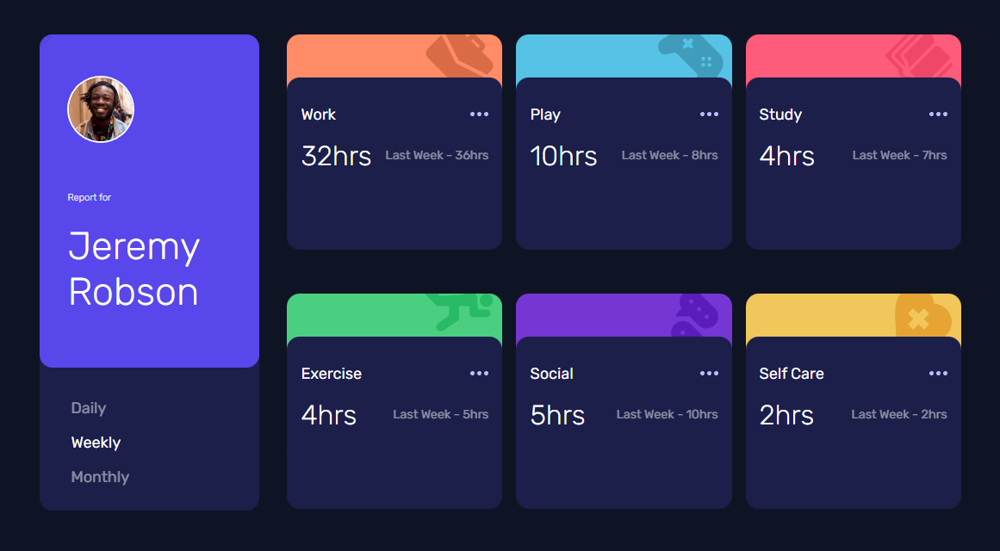

# Frontend Mentor - Time tracking dashboard solution

This is a solution to the [Time tracking dashboard challenge on Frontend Mentor](https://www.frontendmentor.io/challenges/time-tracking-dashboard-UIQ7167Jw). Frontend Mentor challenges help you improve your coding skills by building realistic projects. 

## Table of contents

- [Overview](#overview)
  - [The challenge](#the-challenge)
  - [Screenshot](#screenshot)
  - [Links](#links)
- [My process](#my-process)
  - [Built with](#built-with)
  - [What I learned](#what-i-learned)
  - [Useful resources](#useful-resources)
- [Author](#author)


## Overview

### The challenge

Users should be able to:

- View the optimal layout for the site depending on their device's screen size
- See hover states for all interactive elements on the page
- Switch between viewing Daily, Weekly, and Monthly stats

### Screenshot



### Links

- [Solution URL](https://www.frontendmentor.io/solutions/time-tracking-app-with-fetch-and-responsive-layout-EuaSyib4fH))
- [Live Site URL](https://rickhalmoguera.github.io/Time-tracking-dashboard/))

## My process

### Built with

- Semantic HTML5 markup
- CSS custom properties
- Flexbox
- CSS Grid
- Mobile-first workflow
- Fetch Method.

### What I learned

This time cards were created from Js, getting the data from the datsa.json.

As you can see in the code below. I started by checking which timeframe the user had chosen with a forEach , in order to display the correct text and information. After injecting the code to the DOM I have verified which card was showing, in order to use the correct image and background color. This was done with an If Else block.
```js
const displayCards = (data)=>{

    data.forEach(element => {

        if(selectedTimeframe == "weekly"){
            pathCurrent = element.timeframes.weekly.current
            pathPrevious = element.timeframes.weekly.previous
        }else if(selectedTimeframe == "daily"){
            pathCurrent = element.timeframes.daily.current
            pathPrevious = element.timeframes.daily.previous
        }else if(selectedTimeframe == "monthly"){
            pathCurrent = element.timeframes.monthly.current
            pathPrevious = element.timeframes.monthly.previous
        }

        activitiesCard.innerHTML +=
        `<div class="card-container" id="card${data.indexOf(element)}">
        <div class="card-background-container" id="bgColor${data.indexOf(element)}">
            
        </div>

        <div class="card-text-container">
            <div class="card-header">
                <span>${element.title}</span>
                
            </div>
            <div class="card-text">
                <span class="card-text-hours">
                ${pathCurrent}hrs
                </span>
                <span class="card-text-last">Last ${timeFrame} - ${pathPrevious}hrs </span>
            </div>
        </div>
    </div>` 

        if(element.title == "Work"){
            const bgImg0 = document.getElementById("bgImg0")
            const bgColor0 = document.getElementById("bgColor0")

            bgImg0.src="./images/icon-work.svg"
            bgColor0.classList.add("work")
        }else if(element.title == "Play"){
            const bgImg1 = document.getElementById("bgImg1")
            const bgColor1 = document.getElementById("bgColor1")

            bgImg1.src="./images/icon-play.svg"
            bgColor1.classList.add("play")
        }else if(element.title == "Study"){
            const bgImg2 = document.getElementById("bgImg2")
            const bgColor2 = document.getElementById("bgColor2")

            bgImg2.src="./images/icon-study.svg"
            bgColor2.classList.add("study")
        }else if(element.title == "Exercise"){
            const bgImg3 = document.getElementById("bgImg3")
            const bgColor3 = document.getElementById("bgColor3")

            bgImg3.src="./images/icon-exercise.svg"
            bgColor3.classList.add("exercise")
        }else if(element.title == "Social"){
            const bgImg4 = document.getElementById("bgImg4")
            const bgColor4 = document.getElementById("bgColor4")

            bgImg4.src="./images/icon-social.svg"
            bgColor4.classList.add("social")
        }else if(element.title == "Self Care"){
            const bgImg5 = document.getElementById("bgImg5")
            const bgColor5 = document.getElementById("bgColor5")

            bgImg5.src="./images/icon-self-care.svg"
            bgColor5.classList.add("self-care")
        }
        
    });
```

### Useful resources

- [JavaScript Array forEach()](https://www.w3schools.com/jsref/jsref_foreach.asp) - This helped me to understand the FOrEach sintaxis and use it in the displaying of the background and images of the cards.

## Author

- Github - [Ricardo Halmoguera](https://github.com/RickHalmoguera)
- Frontend Mentor - [@RickHalmoguera](https://www.frontendmentor.io/profile/RickHalmoguera)
